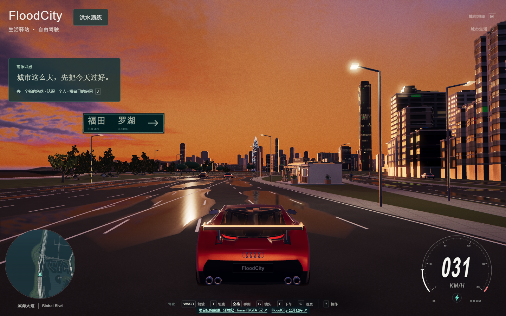

# FloodCity

**在可驾驶的城市里，看看一场暴雨怎样改变道路、水深和到达路线。**

[▶ 在线试玩](https://brucecheng-ai.github.io/FloodCity/) · [洪水机制介绍](https://brucecheng-ai.github.io/FloodCity/flood-guide.html) · [项目初始来源：深城纪](https://github.com/linranff/GTA_SZ)

## 这是什么

FloodCity 是一款在浏览器中运行的 3D 城市游戏公开版本。玩家可以沿街驾驶、步行探索、查看城市地图，也可以进入“洪水演练”，观察积水如何改变车辆速度和路线选择。城市游戏基础源自 **[深城纪（linranff/GTA_SZ）](https://github.com/linranff/GTA_SZ)**；本仓库是 **[FloodCity 的公开体验版本](https://github.com/BruceCheng-AI/FloodCity)**。

## 体验洪水演练

1. 打开[在线游戏](https://brucecheng-ai.github.io/FloodCity/)，等待城市载入完成。
2. 点击画面上方的 **“洪水演练”**，在地图上依次选择起点和终点。
3. 按需调整峰值积水和演练范围，比较晴天路线与暴雨峰值路线，然后点击 **“确认并开始演练”**。
4. 观察水深、道路状态和路线决策；遇到阻断时，可以比较继续当前路线与绕行的结果。

| 游戏中的水深 | 车辆与导航会怎样反应 |
| --- | --- |
| 不超过 5 cm | 车辆保持正常驾驶响应。 |
| 超过 5 cm、低于 50 cm | 水越深，游戏中的限速和油门响应越弱；30 cm 时限速保留率约为 8.8%。 |
| 道路局部达到 30 cm | 该路段退出导航候选路线，规划器寻找可行绕行；手动驾驶车辆仍可能缓慢移动。 |
| 车辆位置达到 50 cm | 手动驾驶车辆停驶。 |

演练中的水深随时间变化。地图可查看当前风险与最大淹没；规划器检查每段道路的起点、中点和终点。想了解这些规则如何联动，可打开[交互式机制介绍页](https://brucecheng-ai.github.io/FloodCity/flood-guide.html)。

## 基本操作

建议使用支持 WebGL 的桌面浏览器。游戏画面由玩家设备的浏览器渲染；GitHub Pages 提供网页和资源，不需要发布者的电脑持续开机。

| 操作 | 按键 |
| --- | --- |
| 油门 / 刹车、转向 | `W` / `S`、`A` / `D` |
| 手刹、切换镜头 | `空格`、`C` |
| 打开城市地图 | `M` |
| 上下车、切换无人机观景 | `F`、`G` |
| 切换日落 / 夜色 / 晴日 | `L` |
| 打开城市生活 | `J` |

进入步行、无人机等模式后，屏幕上的操作提示会随模式变化。

## 仓库与素材说明

- 本仓库保存可直接由 GitHub Pages 提供的**公开构建文件**，不包含完整开发源码，也不需要在本仓库执行安装或构建命令。初始城市项目的源码见[深城纪 GitHub 仓库](https://github.com/linranff/GTA_SZ)。
- 地图和第三方素材的来源、许可及说明见 [`licenses/`](licenses/)、[`assets/ATTRIBUTION.md`](assets/ATTRIBUTION.md) 和 [`city/LANDMARK_ATTRIBUTION.md`](city/LANDMARK_ATTRIBUTION.md)。公开版本使用可发布的替代角色；原包禁止二次配布的角色模型未包含在此仓库。
- 洪水内容是**游戏中的合成情景**，不提供实时洪水预报，也不构成现实涉水驾驶或避险建议。
